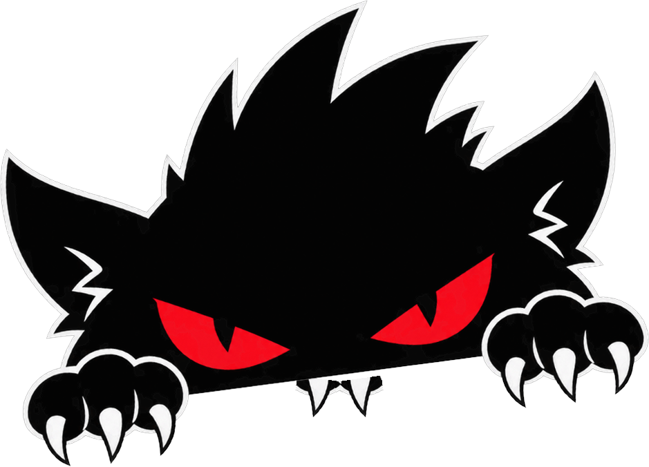
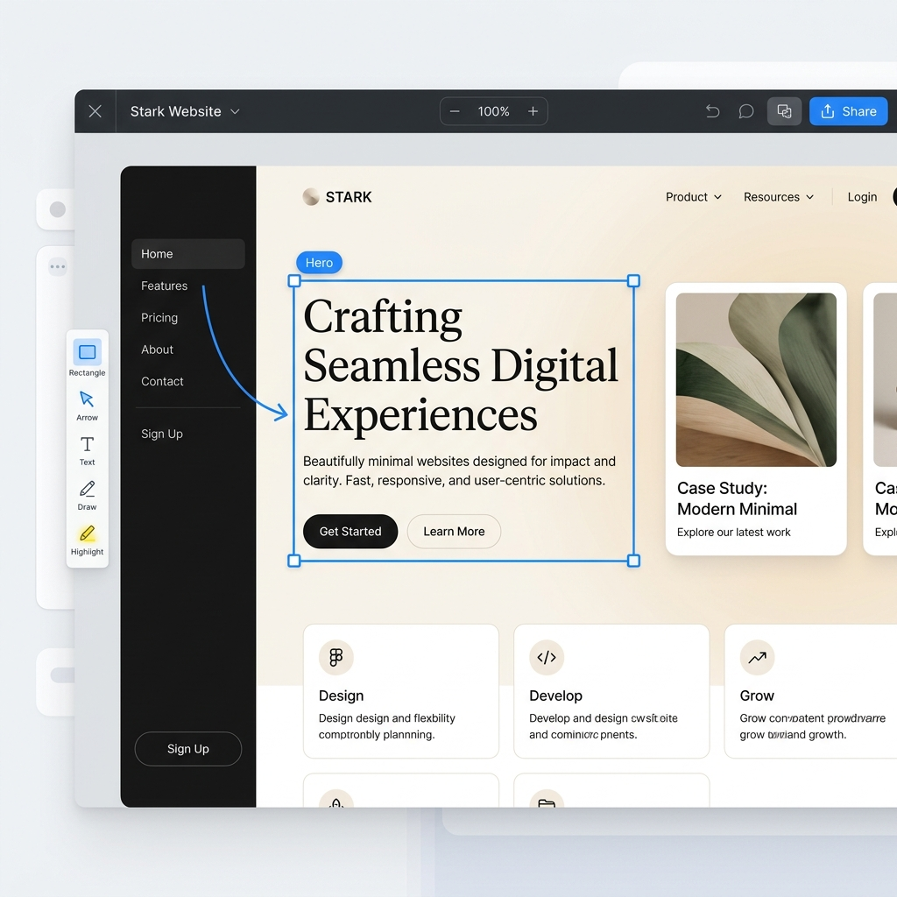

<div align="center">

  

  # ⚡ SNITCH

  ### *Catch your screen red-handed.*

  **Lightweight, local-first screen capture & visual annotation studio for the modern web.**  
  *100% client-side, zero telemetry, private forever, with an iconic Nothing Phone dot-matrix aesthetic.*

  <br />

  <p align="center">
    <a href="https://github.com/codewithevilxd/snitch/stargazers"></a>
    <a href="https://github.com/codewithevilxd/snitch/blob/main/LICENSE"></a>
    <a href="https://react.dev/"></a>
    <a href="https://vite.dev/"></a>
    <a href="https://tailwindcss.com/"></a>
    
  </p>

  <p align="center">
    <a href="#-quick-start"><b>Quick Start</b></a> •
    <a href="#-key-features"><b>Features</b></a> •
    <a href="#-keyboard-shortcuts"><b>Shortcuts</b></a> •
    <a href="#-architecture"><b>Architecture</b></a> •
    <a href="#-contributing"><b>Contributing</b></a>
  </p>

  <br />

  

</div>

<br />

---

## 💡 Why Snitch?

Most modern screenshot and screen recording tools are either **locked to macOS (CleanShot X)**, bloated with electron dependencies, or **upload your private screens, tokens, and credentials to third-party cloud servers**.

**Snitch** is designed for engineers, designers, and creators who demand:
- 🛡️ **Total Privacy**: 100% client-side. Zero telemetry, zero analytics tracking, and zero cloud uploads. Your pixels never leave your browser.
- ⚡ **Instant Performance**: Snappy, sub-pixel HTML5 Canvas 2D engine with zero lag.
- 🎨 **Quiet Luxury Aesthetics**: Inspired by the minimalist **Nothing Phone OS** dot-matrix hardware design and Apple macOS glassmorphism.
- 🖱️ **Zero-Friction Workflow**: Native screen capture via `getDisplayMedia`, sub-pixel vector annotations, quick redaction, and instant 1-click clipboard copying.

---

## ✨ Key Features

### 🎯 1. Native In-Browser Screen Capture
- **Full Display, Window, or Custom Crop**: Seamless integration with the browser's native `Display Media API`.
- **Zero Extension Required**: Works out of the box on any modern Chromium, Firefox, or Safari browser without installing third-party browser extensions.
- **Local File Drag-and-Drop**: Easily drop any existing PNG, JPG, or WebP screenshot directly into the studio to annotate.

### ✏️ 2. Sub-Pixel Vector Annotation Studio
- **Shapes**: High-contrast Rectangles, Rounded Cards, Ellipses, and Dividers.
- **Directional Arrows & Lines**: Fluid, auto-snapping vector arrows with configurable head styles and weights.
- **Pen & Highlighter**: Freehand drawing with pressure-sensitive strokes and translucent highlighter overlays.
- **Text Callouts**: Clean typographic overlays with custom font choices, alignment, and background badges.
- **Non-Destructive Manipulation**: Select, move, resize, rotate, and layer any annotation on the fly.

### 🔒 3. Instant Local Redaction & Pixelate
- **Blur & Pixelate Brush**: Hide passwords, API keys, emails, and sensitive user data with a single mouse drag.
- **Client-Side Security**: Redactions are physically rasterized into the canvas bitmap on export—meaning hidden data cannot be recovered by inspecting DOM or layers.

### 🖼️ 4. Aesthetic Studio Framing & Presets
- **Canvas Presets**: Automatically frame your screenshot inside custom backgrounds:
  - *Minimalist Monochrome*
  - *Subtle Studio Gradients*
  - *Organic Mesh Blends*
  - *Custom Wallpaper Image Upload*
- **Window Controls**: Add authentic macOS traffic lights (red, yellow, green), rounded corners, and customizable drop shadows.
- **Color Filters**: One-click LUT filters including *Mono Ink*, *Crisp Pop*, *Warm Glow*, *Sepia Film*, and *Noir Blue*.

### ⚡ 5. Rapid Keyboard-Driven Workflow
- **1-Click Clipboard Copy** (`⌘C` / `Ctrl+C`): Export directly to system clipboard as a high-density PNG, ready to paste into Slack, GitHub, Discord, or Notion.
- **Direct High-Res Export** (`⌘E` / `Ctrl+E`): Save losslessly compressed PNGs to your disk.
- **Undo / Redo History** (`⌘Z` / `⌘⇧Z`): Complete state history tracking for every stroke and mark.

### 🌓 6. Nothing Phone Typography & Interactive Venetian Blinds Toggle
- **100% Nothing Phone Typography**: Built with official **`NDot57`** dot-matrix font for authentic industrial tech aesthetics.
- **Native View Transition Blinds Theme Toggle**: Powered by the browser's native View Transition API (`@property --beui-vt-slat`) with custom Venetian blinds animations.

---

## ⌨️ Keyboard Shortcuts

Snitch is engineered for power users who hate clicking through menus:

| Shortcut | Action | Description |
| :--- | :--- | :--- |
| <kbd>C</kbd> | **Crop** | Frame or crop your screen capture |
| <kbd>V</kbd> | **Select / Move** | Select, drag, or re-order any annotation shape |
| <kbd>P</kbd> | **Pixelate / Blur** | Redact sensitive passwords, keys, or private data |
| <kbd>R</kbd> | **Rectangle** | Draw high-contrast bounding boxes |
| <kbd>A</kbd> | **Arrow** | Point out bugs, features, and UI details |
| <kbd>T</kbd> | **Text** | Add clean typography overlays and notes |
| <kbd>D</kbd> | **Draw / Pen** | Freehand marker and sketching |
| <kbd>H</kbd> | **Highlight** | Translucent marker for emphasizing text |
| <kbd>⌘</kbd> + <kbd>C</kbd> / <kbd>Ctrl</kbd> + <kbd>C</kbd> | **Copy to Clipboard** | Copy export-ready PNG directly to clipboard |
| <kbd>⌘</kbd> + <kbd>E</kbd> / <kbd>Ctrl</kbd> + <kbd>E</kbd> | **Export Image** | Download high-res PNG to your downloads folder |
| <kbd>⌘</kbd> + <kbd>Z</kbd> / <kbd>Ctrl</kbd> + <kbd>Z</kbd> | **Undo** | Step backward in annotation history |
| <kbd>⌘</kbd> + <kbd>⇧</kbd> + <kbd>Z</kbd> / <kbd>Ctrl</kbd> + <kbd>Y</kbd> | **Redo** | Step forward in annotation history |
| <kbd>Delete</kbd> / <kbd>Backspace</kbd> | **Delete** | Remove selected shape or text |

---

## 🛠️ Architecture & Tech Stack

```
   ┌─────────────────────────────────────────────────────────┐
   │                  Browser DisplayMedia API               │
   │           (Screen / Window / Tab / File Drop)           │
   └────────────────────────────┬────────────────────────────┘
                                │
                                ▼
   ┌─────────────────────────────────────────────────────────┐
   │            Offscreen Canvas Compositor Engine           │
   │  ┌───────────────────────────────────────────────────┐  │
   │  │  Layer 0: Framing, Padding & Background Gradient  │  │
   │  ├───────────────────────────────────────────────────┤  │
   │  │  Layer 1: Raw Screen Capture Bitmaps              │  │
   │  ├───────────────────────────────────────────────────┤  │
   │  │  Layer 2: Local Redaction / Pixelation Filter     │  │
   │  ├───────────────────────────────────────────────────┤  │
   │  │  Layer 3: Vector Shapes, Arrows, Highlights, Text │  │
   │  └───────────────────────────────────────────────────┘  │
   └────────────────────────────┬────────────────────────────┘
                                │
                                ▼
   ┌─────────────────────────────────────────────────────────┐
   │         Export Engine (100% Client-Side Render)         │
   │    ┌──────────────────────────┬──────────────────────┐  │
   │    │ System Clipboard (PNG)   │ File Download (PNG)  │  │
   │    └──────────────────────────┴──────────────────────┘  │
   └─────────────────────────────────────────────────────────┘
```

- **Core**: React 19, TypeScript, Vanilla HTML5 Canvas 2D
- **Build Engine**: Vite 8 with Rolldown native bundler
- **Styling**: Tailwind CSS v4, Lucide Icons, Radix UI Primitives
- **Animations & Transitions**: Native CSS `@property` View Transitions, Framer Motion
- **Typography**: Authentic Colophon Foundry Nothing Phone fonts (`NDot57` & `NType82`)
- **Zero Telemetry**: No tracking cookies, no Google Analytics, no third-party CDNs

---

## 🚀 Quick Start

### Prerequisites
- [Node.js](https://nodejs.org/) (version `18.0.0` or higher)
- `npm`, `pnpm`, or `bun`

### Installation

1. **Clone the repository**:
   ```bash
   git clone https://github.com/codewithevilxd/snitch.git
   cd snitch
   ```

2. **Install dependencies**:
   ```bash
   npm install
   ```

3. **Launch the development server**:
   ```bash
   npm run dev
   ```
   Open [http://localhost:3000](http://localhost:3000) in your browser.

4. **Build for production**:
   ```bash
   npm run build
   ```
   The compiled bundle will be output to the `dist/` directory.

---

## 📁 Repository Structure

```text
snitch/
├── index.html                   # Marketing landing page
├── capture.html                 # Screen capture & annotation studio engine
├── public/
│   ├── inki.png                 # Official Inki cat mascot
│   ├── inki-biting-clean.png    # Inki brand logo biting lockup
│   ├── editor-preview.png       # High-res studio interface preview
│   └── fonts/                   # Nothing Phone fonts (NDot57, NType82)
├── src/
│   ├── components/
│   │   ├── blocks/              # Landing page sections (Hero, Features, Shortcuts, Footer)
│   │   ├── motion/              # View transition theme toggle & spring icons
│   │   └── ui/                  # Accessible UI primitives & theme providers
│   ├── react/                   # React app entry points & styling
│   │   ├── landing.tsx          # Main landing page component
│   │   ├── globals.css          # TailwindCSS v4 design tokens & Nothing font rules
│   │   └── toolbar-exact.css    # macOS liquid-glass floating toolbar
│   └── renderer/
│       ├── renderer.js          # Core HTML5 Canvas vector drawing engine
│       ├── web-preview.js       # DisplayMedia screen capture polyfill & clipboard
│       └── styles.css           # Studio canvas styling
├── vite.config.ts               # Multi-page Vite 8 build config
└── package.json
```

---

## 🤝 Contributing

Contributions are what make the open-source community an incredible place to learn, inspire, and create. Any contributions you make are **greatly appreciated**.

1. Fork the Project
2. Create your Feature Branch (`git checkout -b feature/AmazingFeature`)
3. Commit your Changes (`git commit -m 'feat: Add AmazingFeature'`)
4. Push to the Branch (`git push origin feature/AmazingFeature`)
5. Open a Pull Request

---

## 📄 License

Distributed under the **MIT License**. See [`LICENSE`](LICENSE) for more information.

---

<div align="center">
  Crafted with passion by <strong><a href="https://github.com/codewithevilxd">@codewithevilxd</a></strong>
  <br />
  <sub>If you find Snitch useful, consider giving it a ⭐ star on GitHub!</sub>
</div>
